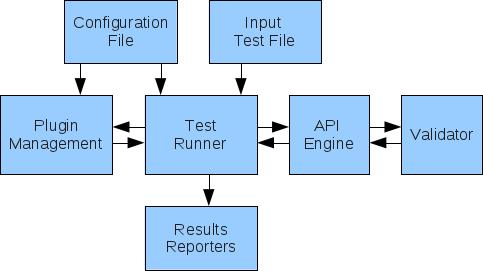

Introduction
============
Automated REST Testing (ART) is a framework for automated tests of REST APIs.

ART works via product xsd file (xml schema documents) that describe the structure of all possible xml requests and responses.
You can run your REST API requests easily with ART and get them validated automatically. Your tests results are generated in xml and junit formats so it can be easily integrated with other tools.
ART is a plugin based so new features and functionality can be added easily by extending one of the existed plugins or writing your own.

ART structure
--------------

Features
---------
* Builds python data structures based on XML Schema document. The data structures represent the elements described by the XML Schema. ART has parser that loads XML document into Python data structures and vice versa . generateDS tool is used for this purpose. For more information on generateDS see:  http://cutter.rexx.com/~dkuhlman/generateDS.html.
* Sends all types of REST API requests: GET, PUT, POST, DELETE.
* Auto-discovery of action functions. These actions can be accessed from input test scenario file.
* Supports 3 formats for input test scenario file: ODS Spreadsheet, XML file, Python script.
* Can use different placeholders in input file to get parameters from configuration file.
* Support config spec files to validate configuration parameters and set default values
* Fetches output from one action to be reused in further test actions.
* Can group tests into test sets.
* Can run tests in loop(sequentical or simultaneously) and by conditions.
* Can easily add request headers via configuration file.
* Validates the responses via sent request content and .xsd file.
* Generates simple xml and junit tests results. Report can be configured to contain sub-tests (nested reports).
* Supports different REST based engines (sdk, cli, etc.).
* Supports parallel runs from the same configuration file or from different ones.
* Supports plugin management for adding new functionality to main engine (Test Runner). Based on Trac Component Architecture: http://trac.edgewall.org/wiki/TracDev/ComponentArchitecture

System Requirements
--------------------
* Red Hat Enterprise Linux Server release 6.2
* Python 2.6-2.7
* Mozilla Firefox 10 and higher