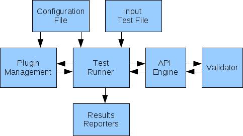

.. ART documentation master file, created by sphinx-quickstart on Mon

Edited version: Feb 1 2013.

Welcome to ART's documentation!
===============================

Automated REST Testing (ART) is a framework for automated testing of REST
APIs.

Introduction
============

Automated REST Testing (ART) is a framework for automated testing of REST
APIs.

ART works via a
product xsd file (xml schema documents) that describes the structure of
all possible xml requests and responses. You can run your REST API
requests easily with ART and validate them automatically. Your tests'
results are generated in xml and junit formats for easy integration with
other tools.

ART structure
-------------

Features
--------

-   Builds python data structures based on the XML Schema document. The
    data structures represent the elements described by the XML Schema.
    ART has a parser that loads XML documents into data structures and
    vice versa. The generateDS tool is used for this purpose. For more
    information on generateDS see:
    http://cutter.rexx.com/~dkuhlman/generateDS.html.

-   Sends all types of REST API requests: GET, PUT, POST, DELETE.

-   Auto-discovery of action functions. These actions can be accessed
    from the input test scenario file.

-   Supports 3 formats for the input test scenario file: ODS
    Spreadsheet, XML file, Python script.

-   Different placeholders can be used in the input file to get
    parameters from configuration file.

-   Support config spec files to validate configuration parameters and
    set default values

-   Fetches output from one action to be reused in further test actions.

-   Tests can be grouped in test sets.

-   Tests can be run in loop (sequentially or simultaneously) and by
    conditions.

-   Request headers are easily added via the configuration file.

-   Validates the responses via sent request content and via .xsd file.

-   Generates simple xml and junit test results. Reports can be
    configured to contain sub-tests (nested reports).

-   Supports different REST-based engines (sdk, cli, etc.).

-   Supports parallel runs from the same configuration file or from
    different ones.

System Requirements
-------------------

-   Red Hat Enterprise Linux Server release 6.2

-   Python 2.6-2.7

-   Mozilla Firefox 10 or higher

Installation
=============

Installing from git
-------------------------------------------

Clone the project from the git repository::

    git clone git://git.engineering.redhat.com/users/edolinin/ART.git

Also install the following Python packages: yum install python-lockfile
odfpy python-tpg pexpect python-lxml python-psycopg2

Installing from yum
-------------------------------------------

Download ART rpm compatible with your OS (currently RHEL and Fedora are
supported): http://art-build-srv.lab.eng.tlv2.redhat.com/art/

Install the rpm::

    yum install -y --nogpgcheck art-*

Quick Start
===========

If your application has a REST API and makes use of XML application
content, you can test it using ART framework. See the instructions below
for a quickstart test.

Data Structures
---------------

Before you start working with ART, you need to generate Python data
structures from the api.xsd file of your application. There are two
different ways to do this:

-   The first, and simplest option is to acquire the hard-coded version
    of the api.xsd file and then generate hard-coded versions of the
    data structures. This is not generic, since any change to the
    api.xsd file means you will have to regenerate the data structures
    again. However, this approach means you can begin testing
    immediately.

    -   Create data structures module of your project under ART/art::

            mkdir my_app/data_struct

    -   Make it a Python module::

            touch my_app/__init__.py
            touch my_app/data_struct/__init__.py

    -   Download api.xsd file from your application and put it at
        `my_app/data_struct`

    -   Run `generateDS/generateDS.py` to generate the data structures
        module::

            python generateDS.py -f -o ../my_app/data_struct/data_structures.py --member-specs=dict ../my_app/data_struct/api.xsd

        or to redefine default namespace to empty (when working with
        OpenStack REST APIs for an example)::

            python generateDS.py -f  -o ../my_app/data_struct/data_structures.py --member-specs=dict -a '' ../my_app/data_struct/api.xsd

-   The second option is to implement Python functions that download the
    api.xsd file and run the above script. This generates the data
    structures automatically on each test run. Run this implementation
    in `my_app/__init__.py`. The example is in `rhevm_api/__init__.py`.

Develop the tests
-----------------

-   Create a new module which will contain the Python tests for your
    application::

        touch my_app/tests.py

-   Develop your testing function::

        from art.core_api.apis_utils import data_st
        from from art.rhevm_api.utils.test_utils import get_api

        ELEMENT = 'test_object'
        COLLECTION = 'tests_objects'
        util = get_api(ELEMENT, COLLECTION)

        def addObject(positive, **kwargs):
        '''
        Creating some object
        '''

            majorV, minorV = kwargs.pop('version').split(".")
            objVersion = data_st.Version(major=majorV, minor=minorV)

            obj = data_st.TestObject(version=objVersion, **kwargs)

            obj, status = util.create(obj, positive)

            return status

-   Create xml interface for your test in `/tmp/my_app_test.xml`::

        <input>
            <test_case>
                <test_name>Create Object Test</test_name>
                <test_action>addObject</test_action>
                <parameters>name='MyTestObj',version='{version}'</parameters>
                <positive>true</positive>
                <run>yes</run>
            </test_case>
        </input>

Basic Configuration
-------------------

Define your configuration file as follows (set REST_CONNECTION
according to your application definitions)::

    [RUN]
    tests_file = /tmp/my_app_test.xml
    data_struct_mod=my_app.data_struct.data_structures
    api_xsd = my_app/data_struct/api.xsd

    [REST_CONNECTION]
    scheme = <http|https>
    host = <app_server>
    port = <app_port>
    user = <app_user>
    password = <app_password>
    user_domain = <app_domain>

    [PARAMETERS]
    version = 3.0

Run
---

Run the test from ART/art with your configuration file::

    python run.py -conf=<path_to_your_conf> -log=/tmp/app_log.log

Analyse the results
-------------------

Check file `art/results/results.xml` for the test results or
`/tmp/app_log.log` for more details.

Configuration
=============

Open `conf/settings.conf` file. This is an example of your main
configuration file, which contains the following sections:

[RUN] section
-------------

-   **engine** - if you have several engines supported in project and
    based on REST (sdk, cli, etc.), you can switch between the engines
    by setting the proper value of this parameter. 'rest' is used as the
    default.

-   **tests_file** - file name which contains your test scenario. If
    this file is located in the conf/folder, only its name can be
    specified, otherwise the absolute path to the file must be
    specified. You can list several files, as long as they are run with
    separating commas. The input file can be in XML format, ODS
    Spreadsheet, or a Python script.

-   **tests_sheets** - your test scenario sheets that should be run
    (relevant only for ODS files).

-   **in_parallel** - optional parameter for parallel runs. Lists the
    sheets or xml files that must be run parallel to each other. You can
    run different sheets or xml files, or run the same sheet or xml file
    with different configuration files. These can be done in parallel.
    See the below example.

-   **parallel_configs** - optional parameter for parallel runs. Paths
    to configure files can be set here (again separated by commas) for
    each sheet or xml file running in parallel. If this parameter is
    omitted, a default configuration file of the test is taken.

-   **debug** - if the test needs to be run in debug mode or not. If
    this parameter is set to 'no', only INFO and ERROR messages will be
    printed to the log file.

-   **data_struct_mod** - path to data structures file generated by
    generateDS (see the Quickstart Data Structures section for how to create it).

-   **api_xsd** - path to xml schema documents file.

-   **media_type** - application/xml for xml format, application/json
    for json format.

Example for RUN section simple configuration::

    [RUN]
    engine = rest
    tests_file = /tmp/rest.xml
    data_struct_mod = data_struct.data_structures
    api_xsd = /data_struct/api.xsd

Example for the same xml file running in parallel with different
configuration files::

    [RUN]
    tests_file = /tmp/test.xml, /tmp/test.xml
    in_parallel=/tmp/test.xml, /tmp/test.xml # same or different xml files can be set here
    parallel_configs = conf/settings.conf, conf/settings2.conf # paths to config files, if omitted - default config is set

Customized sections for parallel run
------------------------------------
One configuration file can run the same test file in parallel with
different parameters. For each of the parallel threads, define new
configuration sections with their required parameters. For example::

    [RUN]
    tests_file = /tmp/test.xml,/tmp/test.xml
    in_parallel=/tmp/test.xml,/tmp/test.xml
    parallel_sections = test1, test2
    ...

    [TEST1]
    name=test1

    [TEST2]
    name=test2

[REST_CONNECTION] section
--------------------------
This section defines parameters for connecting to the REST API
application:

-   **scheme** - 'http' or 'https'

-   **host** - your REST client machine

-   **port** - port used by REST APIs

-   **entry_point** - REST APIs main url suffix (for example: :/api/
    entry_point=api)

-   **user** - user name to connect to REST APIs client

-   **user_domain** - user domain

Example for the secured http connection::

    [REST_CONNECTION]
    scheme = https
    host = host.redhat.com
    port = 443
    user = admin
    password = 123456
    entry_point = api
    user_domain = qa.lab.redhat.com

[PARAMETERS] section
--------------------
This section defines the test's global parameters. They are optional,
and can be removed or extended depending on the test scenario
definitions in your input test scenario file. These parameters can be a
single value or a list of values (separated by commas). Different
place-holders can access the parameters from the test scenario file.

Defining spec files
-------------------

ART configuration settings are based on the ConfigObj module that allows
you to define Configspec files. Configspec files set the rules for
validating your configuration parameters and default values of
parameters not defined by the user. For more information check:
http://www.voidspace.org.uk/python/configobj3.html#configspec

You can define Configspec files for any sections or parameters. You can
use basic ConfigObj validation functions or functions from
`art/test_handler/handler_lib/configs.py`.

By default ART uses the `art/conf/main.spec` file to validate your
configuration. If you would like to add more spec files for this
validation you can define additional parameters in the `PARAMETERS`
section `test_conf_specs` and submit the paths to your spec files. For
example::

    [PARAMETERS]
    test_conf_specs = conf/specs/rhevm_params.spec,

.. note::

    Defining Configspec files allows you to significantly reduce the size of configuration files and simplifies the creation of new ones.

Input Test Scenario File
========================

This file defines the test scenario. Each test case in the file should
contain the following (note:: xml node for .xml file, column for .ods file, TestCase
object attributes for .py file):

-   test_name - *mandatory* Name of the test that will appear in
    reports

-   test_action - *mandatory* Action implements the test. Each action
    maps to the function in the conf/actions.conf file

-   parameters - *mandatory* Parameters received by the test. See
    `Parameters`\_ section for more information.

-   positive - *mandatory* TRUE if the test should succeed. FALSE if not.
    You can set NONE if you do not want your function to use this
    parameter.

-   run - *mandatory*. 'yes' if the test should be run. 'no' if you want
    to skip the test. To specify a Python condition, see the :ref:`runconditions` section.

-   report - *optional* (default is ‘yes’). 'yes if the test results are
    to be reported (see results.xml file). Otherwise, 'no'. If you omit
    this column, all tests are reported.

-   fetch_output - *optional* If your function returns value that you
    want to use in future tests, specify it in this column. The function
    will return additional values (excluding status) in dictionary
    format. You need to specify the key name that relates to the desired
    output value, as well as where to put the parameter name. See
    `Fetch Output`\_ section.

-   vital - *optional* (default is ‘no’). 'yes' if test is vital and
    future tests cannot continue without its success. Otherwise, 'no'.
    If vital test fails, all future tests will not run.

-   test_description - *optional* A detailed description of your test.

-   conf - *optional* Option to change the global configuration settings
    for each test case. For example if you want to change the user for
    one of the tests and http headers, you can set the following::
    `headers={'Filter': true}, user='new_user'`

Grouping tests
--------------

You can group your tests according to functionality, flows, testing
purpose, etc. To define a custom group in the input file, add a new test
case before the tests you want grouped. Fill the test case as follows:
`test_name=START_GROUP: <name_of_tests_group>`. All other fields except 'run' are non-applicable and can be set as 'n/a' or skipped entirely.
To run the group of tests you need to set the 'run' value. Possible run
values are 'yes' to run, and 'no' to not run the group. It can be also loop
or condition the statement. See possible 'run' values below (:ref:`runconditions`). All these 'run' values are applicable for test groups as well. Here's an example for
starting group in xml file::

    <test_case>
        <test_name>START_GROUP: Setup</test_name>
        <run>yes</run>
    </test_case>

To mark the test group's finishing point, add a new test case after the
last group test and fill it as:
`test_name=END_GROUP:<name_of_tests_group>` The test group's name needs
to be the same as the START_GROUP value. Here's an example for ending
group in xml file::

    <test_case>
        <test_name>END_GROUP: Setup</test_name>
    </test_case>

Parameters
----------

Parameter names correspond to the names of test function
parameters. You can use parameter names from `conf/settings.conf` file
here as place holders.

Put the parameter name in {} brackets and it will be replaced with the
relevant value at runtime. If you want to get product constants
from the `conf/elements.conf` section, call it e{param_name}.

If the parameters are defined in a comma-separated-values list in
'conf/settings.conf', you can fetch the values of any parameter in that
list by making use of a kind of array indexing -
*{name_of_param[param_index]}*.

If you want to get this listed as a string, call it
*[name_of_param]*.

If you are using loop in 'run' column (see below) you can concatenate
loop iteration index to any of your parameters.

Here are a few examples for values of parameters column::

Get parameter 'compatibility_version' from settings::

    name='Test1',version='{compatibility_version}'

Get parameter 'storage_type_nfs' from conf/elements.conf::

    name='Test1',storage_type='e{storage_type_nfs}'

Get first parameter from list of 'vm_names' from settings::

    name='{vm_names[0]}'

Get list of 'vm_names' names as a string from settings::

    name='[vm_names]'

Add iteration index to name (relevant when running in loop)::

    name='testVM#loop_index'

.. _runconditions:

Run Conditions
--------------

Simple condition:

    ``if(<condition>)``

Action condition:

    ``ifaction(<action_name>,<action parameters>) # test will run if action returns True``

    ``not ifaction(<action_name>,<action parameters>) # test will run if action return False``

Loop and forkfor: Loops can make several same operations. While loop
does all iterations one at a time, forkfor executes them simultaneously.
Both can be used with groups to execute the content several times. You
can iterate over predefined number, range, parameters or number defined
in configuration file:

    ``loop(<number_of_iterations>) loop(<iterations_range>) loop({<parameter_name_to_iterate_on>}) loop(int{xxx})``

    ``forkfor(<number_of_iterations>) forkfor(<iterations_range>) forkfor({<parameter_name_to_iterate_on>}) forkfor(int{xxx})``

Because Python threads are limited, the forkfor parameter cannot be
greater than 600. For example: forkfor(600). In addition, executing too
many requests can lead to load problems on the remote side.

You can use 'if' and 'loop' together:

    ``if(<condition>);loop(<number_of_iterations>)``

Examples:

Simple condition::

    if('{compatibility_version}'=='2.3')

    if(len({hosts})>2) # will run if number of values in ‘hosts’ parameter in configuration file is greater than 2

Action conditions::

    ifaction(activate_host,'TRUE',name='{host}')

    not ifaction(activate_host,'TRUE',name='{host}')

Loop statements::

    loop(5)
    loop(5-10)
    loop({os_name})
    loop(int{num_of_vms})

'if' and 'loop' together::

    if('{compatibility_version}'=='2.3');loop(5)

You can iterate over several parameters at once. It is a useful example
for host installation. If you want to install several hosts with
different passwords, define the following parameters in *settings.conf*
file::

    hosts = host1,host2,host3
    password = pass1,pass2,pass3

In your input file, put the following into the *parameters* field::

    host={host},password={password}

And in the *run* field::

    loop({host},{password})

Your test will run three times and each time the required action will be
run with the hostname and password relevant to the current iteration.

Fetch Output
------------

If your function returns values that you want to use in future tests,
specify them in this attribute. Your function should return additional
values (excluding status) in dictionary format. In this parameter you
need to specify the key name that relates to the desired output value,
as well as the location for the parameter name. The format of this
value should be:
``<fetch_output_from_key_name>-><fetch_output_to_parameter_name>``

Examples::

    osName->myOsName

You can use parameters' place holders in ** (useful for parallel runs)::

    osName->osName{index}

You can use this fetched value as a *parameter* in future testing as
follows::

    vm='MyVm',os_name=%myOsName%

Or with parameters' place holders::

    vm='MyVm',os_name=%osName{index}%

Or to concatenate the fetched output to another string::

    vm='MyVm',os_name='test' + %osName{index}%

To fetch several output parameters at the same time, separate with a
comma. For example::

    osName->myOsName, osType->myOsType

If the function returns a Python list-type object, you can reference the
individual items later on with::

    name=%out%[1]

Test Templates
--------------

You can find test scenario file samples in the `tests/xml_templates/`
folder.

Run the Test
============

Compile
-------

To ensure there are no errors in the .ods or xml files, run a
compilation beforehand. It validates the input file without having to
run the test.

    python run.py  --compile

If there are errors in the .ods or xml file, they will appear in your
console. Fix where necessary.

Run test
--------

When the configuration file is ready, run the test from your working
folder. The test requires several parameters:

    * configFile (conf) - Mandatory path to the settings.conf file .
    * resultsXmlFile (res) - Optional path to the results.xml file, the default is results/results.xml.
    * log - Optional path to the log file, default is /var/log/restTest<timestamp>.log

.. seealso:: Run `python run.py --help` for other possible options.

If you want to run the test with its default parameters, run the main
script as::

    python run.py -conf=<config_path>

Running specific lines/groups
-----------------------------

You can only run specific lines from your .ods file, or specific test
cases from the xml file. In this instance, all other lines and test
cases will be skipped.

Lines numbers should be greater than 1, as the first line in .ods file
is actually a header::

    python run.py -conf=<config_path> --lines=50-60,70,80-90,100

You can run specific test groups and skip other groups::

    python run.py -conf=<config_path> --groups=Test1,Test3,Test5

The test will run and report its actions in your console. Test results
will be reported also in `results/results.xml` .

The log file can be found at `/var/tmp/restTest_<timestamp>.log` or at
the location specified at -log cli option.

Run externally
--------------

If you need to use REST API's functions in your code, independent of the
whole ART framework, you can do it with the TestRunnerWrapper instance.
For Example::

    from art.core_api.external_api import TestRunnerWrapper
    from art.core_api.apis_exceptions import APICommandError
    wrapper = TestRunnerWrapper('10.10.10.10')
    try:
        status = wrapper.runCommand(\
            'art.rhevm_api.tests_lib.low_level.datacenters.addDataCenter',
            'true',name='test',storage_type='NFS',version='3.1')
    except APICommandError:
        pass #handle error

Creating testing functions
==========================

API initialization
------------------
::

    from rhevm_api.utils.test_utils import get_api
    ELEMENT = 'host' # object name
    COLLECTION = 'hosts' # objects collectionname
    my_api = get_api(ELEMENT, COLLECTION)

Fetching REST Objects from Data Structures
------------------------------------------

There are 2 possible ways:

    **using getDS**::

        from core_api.apis_utils import getDS
        objectName = getDS('ObjectName')

    **directly**::

        from core_api.apis_utils import data_st
        objectName = data_st.ObjectName

Object creation example
-----------------------

::

    def addNewObject(positive, **kwargs): # path to this function will appear in actions.conf
        majorV, minorV = kwargs.pop('version').split(".")
        objVersion = Version(major=majorV, minor=minorV)
        newObject = objectName(version=objVersion, **kwargs) # build new object
        obj, status = my_api.create(newObject, positive) # call for POST method and send new object
        return status  # must return status for test reports

Object update example
---------------------

::

    def updateObject(positive, object_name, **kwargs):
        objForUpdate = my_api.find(object_name)
        newObject = objectName()
        if 'name' in kwargs:
            newObject.set_name(kwargs.pop('name'))
        if 'description' in kwargs:
            newObject.set_description(kwargs.pop('description'))
        newObject, status = my_api.update(objForUpdate, newObject, positive)
        return status

Object delete example
---------------------

::

    def removeObject(positive, object_name):
        obj = my_api.find(object_name)
        return my_api.delete(dc, positive)

Get element from an element collection
--------------------------------------

::

    def getObjectFromOtherObjectCollection(parent_obj_name, get_obj_name):
        objAPI = get_api(object_type, object_collection_name)
        parentObj = objAPI.find(parent_obj_name)
        return my_api.getElemFromElemColl(parentObj, get_obj_name)

Get element sub-collection
--------------------------

::

    def getObjCollection(obj_name, collection_name, collection_elem_name):
        object = my_api.find(obj_name)
        return util.getElemFromLink(object, link_name=collection_name, attr=collection_elem_name,   get_href=True)

Add element to an element sub-collection
----------------------------------------

::

    def addElementToObjCollection(positive, parent_obj_name, add_object_name):
        parentObjColl = getObjCollection(parent_obj_name, collection_name, collection_elem_name)
        addObj = my_api.find(add_object_name)
        obj, status = my_api.create(addObj, positive, collection=parentObjColl)
    return status

Reports
=======

The default location of test results is `results/results.xml`. You can
customize a location using the *--res* parameter during a test run. The
test report header has the following attributes:

-   logfile - path to a test log file

-   testFile - input test file name

All test results appear as sub nodes of the related group, or in the
case of independent tests, as 'test' nodes. The names of test statistics
nodes depend on the parameters set in the *REPORT* section of your
*settings.conf* file. The following default nodes are always added:

-   start_time - time stamp when test started

-   end_time - time stamp when test finished

-   status - test status (Pass/Fail)

-   iter_num - test iteration number

-   all test cases attributes you used in your input file (test_name,
    parameters, positive, etc.)

RHEVM Lib
=========
.. toctree::

    art.rhevm_api.tests_lib.high_level
    art.rhevm_api.tests_lib.low_level
