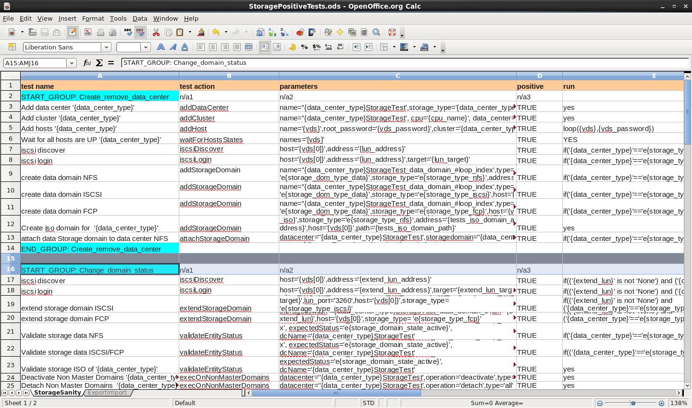

Running with different input files
==================================
Your test scenario can be created in 3 possible formats: XML file, ODS Spreadsheet or Python script.  The examples below show how to define test cases for all of these formats.

Running from ODS file
---------------------
Open a spread sheet of .ods file and  define the following columns headers:

test_name, test_action, parameters , positive, run, report, and all other required tests attributes.
After you have defined the columns headers,  each test case is represented as  a new line in your .ods file.  To create a test case add a new line and fill each its cell according to the column it belongs to.

Here is an example of a test scenario in an .ods file:

Running from XML file
----------------------
Here is an example of an xml input file::

    <input>
    <test_case>
       <test_name>START_GROUP: Test1</test_name>
       <test_action/>
       <parameters/>
       <positive/>
       <run>loop(5)</run>
       <report/>
    </test_case>
    <test_case>
       <test_name>Create NFS Data Center</test_name>
       <test_action>addDataCenter</test_action>
       <parameters>name='dc1',storage_type='NFS',version='2.2'</parameters>
       <positive>TRUE</positive>
       <run>yes</run>
    </test_case>
    <test_case>
       <test_name>END_GROUP: Test</test_name>
       <test_action/>
       <parameters/>
       <positive/>
       <run/>
       <report/>
    </test_case>
    </input>

Running from Python script
--------------------------
Here is an example of running a test case from a Python script::

    from test_handler.python_runner import TestCase
    def addCluster():
            test = TestCase()
            test.name = 'Add Cluster'
            test.action = 'addCluster'
            test.positive = True
            name = test.config['PARAMETERS'].get('cluster_name')
            version = test.config['PARAMETERS'].get('compatibility_version')
            test.params = "name='{0}', version='{1}', cluster='Test',\
                           wait=False".format(name, version)
            test.run()
            test.logger.info(test.status)
            test.logger.info(test.output)